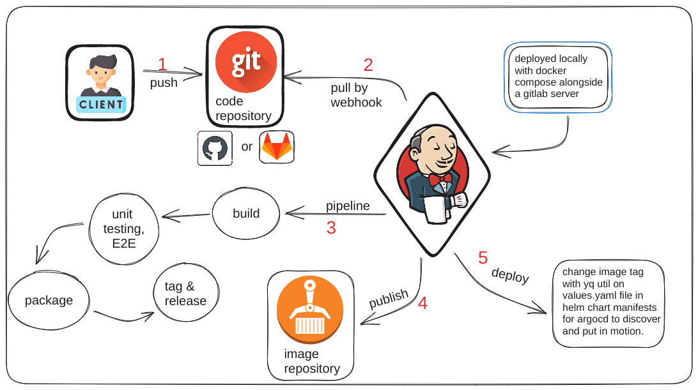

# Bookmaker App:

This is a custom app I build from scratch in golang,
while self learning the inner working of this amaizing coding experience of a language.

This app was designed as a simple web server for some minimal bookmaking, aka gambling.
by defining several endpoints to handle HTTP requests.
The program defines several structs to represent data, including:
Horse, Record, Person, and Bet.
It allows investors to participate in various events.
The app is connected to a MongoDB database for persistancy between events.
Built with Go, utilizing MongoDB, Nginx, Docker & Compose.

## Breakdown:
This app is part of my Portfolio project, which includes
developing and implementing CI/CD workflows with Jenkins, github actions, argocd.
Observability, Logging & Monitoring with EFK, Prometheus & grafana.
Deployed & configured with Kubernetes, Helm, Ansible, Terraform.
While Implementing:
    Microservices Architecture
    Gitops
    Github Flow
    Modularity
    Automation
    
## getting started ->

1. Clone this [repo][bmrepo]: 
> `git clone https://github.com/Slvr-one/bookmaker.git && cd bookmaker`
2. build sources into an image: `./scripts/dockerize.sh`
3. release the image to a private repo: `./scripts/release.sh` 

note!

[make sure to set vars in the scripts to fit yourself]

##  initializing a MongoDB client, connect to a MongoDB database, and insert multiple documents into a collection/table:

-- The initMongoDB function initializes a MongoDB client with the URL "mongodb://localhost:27017", connects to the MongoDB database named "bookmaker", 
-- creates a collection named "bets" in the "bookmaker" database,
-- inserts three documents into the "bets" collection using the InsertMany method.
-- Each document is a BSON document that consists of several fields, such as:
    "fullName", 
    "age", 
    "amount", 
    "profit". 

-- The bson.D type is used to represent a BSON document in Go code. 
-- After inserting the documents, the InsertedIDs field of the InsertManyResult object is printed to the console.

## CI Pipeline:

## REST API REF:

| Path | Method | Description |
| :-------- | :------- | :------- | 
| `/` | `GET` | `Welcome page, displays horses available, current date & time.`
| `/assets` | `GET` | `static content - html, css, js & images` |
| `/health` | `GET` | `Health check endpoint, returns 'GOT HEALTH'. indicate the server is up.` |
| `/metrics` | `GET` | `for monitoring purposes` |
| `/LH` | `GET` | `list all horses available` |
| `/GH/{name}` | `GET` | `list a specific horse's details` |
| `/UH/{name}` | `PUT` | `update a specific horse's details, by name` |
| `/invest/{horse}/{amount}` | `UPDATE` | `Allows the user to place a bet on a specific horse.` |

The program also defines several functions to handle these endpoints.
The GetHorses function returns the number of horses available, 
the GetHorse function returns information about a specific horse, and the Invest function allows the user to place a bet on a specific horse. 
The main function initializes the web server and sets up the routing.

## Tech Stack

For technologies used in this project please Refer to my [main portfolio's repo][portfolio-repo] [Infra.md file][portfolio-infra].

## 🔗 Links

[portfolio-repo]: https://github.com/Slvr-one/TheGarrison
[portfolio-infra]: https://github.com/Slvr-one/TheGarrison/blob/main/Infra.md

[bmrepo]: https://github.com/Slvr-one/bookmaker